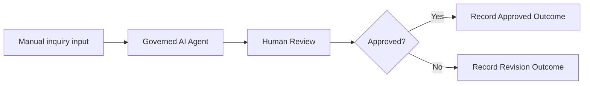
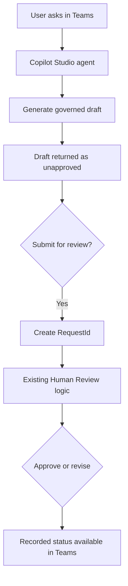

# Governed AI Policy Response Assistant

> An independent Microsoft Copilot Studio portfolio project built by Shalinee Singh.

I designed, configured, tested, and published this low-code workflow to demonstrate how AI-assisted policy drafting can remain subject to human judgment, clear controls, and honest implementation evidence.

## What I built

I implemented the working prototype entirely in **Microsoft Copilot Studio Workflows**.

My implementation includes:

- manual EmailSubject and CustomerInquiry inputs
- a governed Agent with three embedded synthetic policies
- prompt-injection and unsafe-request safeguards
- structured output containing decision, draft response, policy basis, and review note
- Human Review with Yes/No decision and reviewer comments
- approval and revision branches
- separate outcome variables for each branch
- a published workflow and successful Agent-node test
- redacted Outlook Human Review delivery evidence
- requirements, governance controls, UAT artefacts, exception design, and interview documentation

## Phase 2: end-to-end Teams chatbot

I designed the next implementation phase to turn the current workflow into a responsive Teams chatbot without discarding the work already completed.

The design preserves the current Agent instructions, Human Review, approval condition and outcome variables. It separates immediate chat responses from the long-running reviewer decision so the Teams conversation remains responsive.

See the [End-to-End Teams Chatbot Blueprint](projects/customer-email-assistant/teams-chatbot-end-to-end-blueprint.md) for component design, data contracts, implementation sequence, exception handling and UAT criteria.

This phase is designed but not yet claimed as implemented. Agent creation, Teams publication and complete review testing still require the appropriate tenant license, role, capacity and approved connectors.

## Verified status

| Component | Status |
| --- | --- |
| Copilot Studio workflow | Configured and published |
| Agent instructions and synthetic policy context | Implemented |
| Address-update Agent test | Passed |
| Outlook Human Review request | Delivered and rendered |
| Human Review response callback | Blocked by tenant HTTP 400 |
| Teams notification | Blocked by tenant notification service |
| Complete workflow run | Blocked by unavailable Copilot Credits |
| Approval and revision branch execution | Not completed |
| Customer email dispatch | Not implemented |
| Power Automate cloud flow | Not implemented |
| SharePoint or vector knowledge source | Not implemented |
| Conversational user-query trigger | Configuration prepared; blocked by missing tenant license/role |
| Power BI | Not used |

See [Implementation Status](projects/customer-email-assistant/IMPLEMENTATION-STATUS.md) for the authoritative test record.

## Why I chose this design

The Agent drafts, but it does not make the final decision or send an external message. Customer communication can create operational, privacy, legal, and reputational risk, so the workflow keeps a reviewer accountable.

The working prototype uses embedded synthetic policy context because the tenant did not provide an approved SharePoint source or direct local-file knowledge option. I therefore describe it as an inline governed-context prototype, not a RAG or vector-database implementation.

## Evidence

| Evidence | Link |
| --- | --- |
| Published workflow | [Workflow screenshot](projects/customer-email-assistant/evidence/screenshots/01-published-copilot-workflow.png) |
| Successful Agent test | [Agent test screenshot](projects/customer-email-assistant/evidence/screenshots/02-agent-node-test-passed.png) |
| Delivered Human Review request | [Redacted Outlook screenshot](projects/customer-email-assistant/evidence/screenshots/03-human-review-request-delivered-redacted.png) |
| Evidence register | [Evidence README](projects/customer-email-assistant/evidence/README.md) |
| UAT scorecard | [UAT scorecard](projects/customer-email-assistant/evidence/uat-scorecard.md) |

The Outlook evidence proves that the Human Review request was delivered and rendered. It does not prove that the callback completed.

## Technical documentation

- [Project overview](projects/customer-email-assistant/README.md)
- [Implementation status](projects/customer-email-assistant/IMPLEMENTATION-STATUS.md)
- [Agent instructions](projects/customer-email-assistant/copilot-agent-instructions.md)
- [Conversational agent deployment](projects/customer-email-assistant/conversational-agent-deployment.md)
- [End-to-end Teams chatbot blueprint](projects/customer-email-assistant/teams-chatbot-end-to-end-blueprint.md)
- [Teams chatbot RTM and UAT plan](projects/customer-email-assistant/teams-chatbot-rtm-and-uat.md)
- [Business requirements](projects/customer-email-assistant/business-requirements.md)
- [Governance and controls](projects/customer-email-assistant/governance-and-controls.md)
- [Exception handling and resilience](projects/customer-email-assistant/exception-handling.md)
- [UAT and interview guide](projects/customer-email-assistant/uat-and-interview-guide.md)
- [Demonstration script](projects/customer-email-assistant/demo-script.md)
- [Portfolio case study](projects/customer-email-assistant/portfolio-case-study.md)
- [One-page case-study PDF](projects/customer-email-assistant/Governed_AI_Policy_Response_Assistant_Case_Study.pdf)

## What I would add for production

After receiving approved capacity and connectors, I would add a managed knowledge source, durable audit storage, correlation IDs, bounded retries, timeout and escalation paths, monitoring, environment promotion, complete branch testing, and formal business, legal, privacy, security, records, architecture, and platform approvals.

## Responsible-use statement

This project uses synthetic policies and inquiries. It is not a production system, legal advice, or an implementation for any employer or law firm. I do not claim end-to-end execution, production deployment, measured time savings, or functionality that the evidence does not support.

## Author

**Shalinee Singh**  
AI transformation, business analysis, automation, and responsible low-code delivery

## License

MIT. See [LICENSE](LICENSE).
