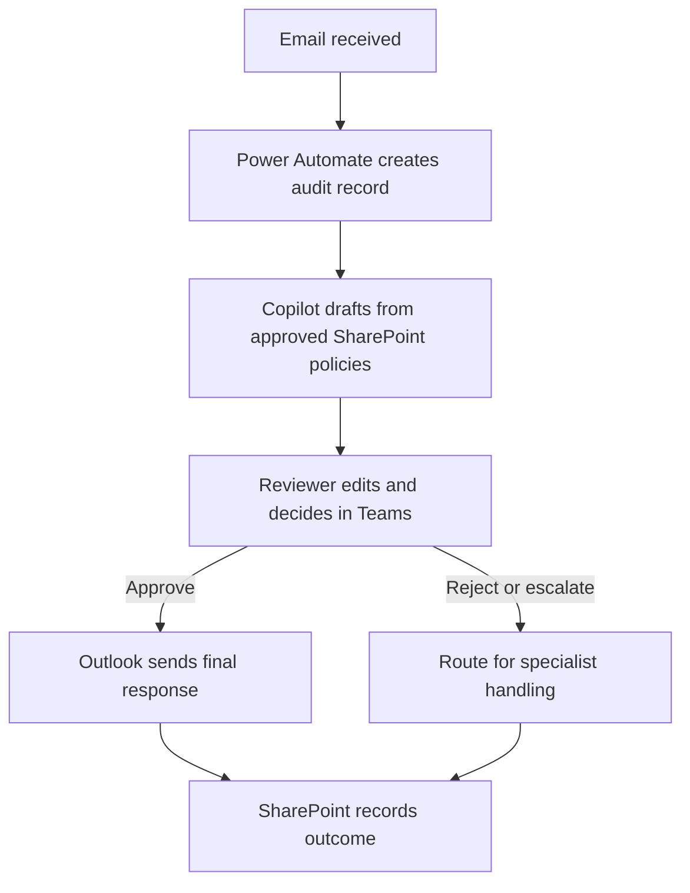

# Governed AI Policy Response Assistant

> A low-code Microsoft Copilot Studio and Power Automate case study for drafting policy-grounded email responses with mandatory human review.

## Executive overview

Customer-service and business teams often spend time searching policy documents, interpreting the relevant guidance, and drafting repetitive email responses. This project redesigns that process using Microsoft 365 services already familiar to business users.

Copilot Studio produces a draft grounded in approved SharePoint content. Power Automate coordinates the workflow. A reviewer receives an editable Teams card and must approve the final text before Outlook can send it. SharePoint retains the decision record for audit and improvement.

| Portfolio fact | Detail |
| --- | --- |
| Delivery approach | Low-code, human-in-the-loop automation |
| Microsoft services | Copilot Studio, Power Automate, SharePoint, Teams and Outlook |
| Primary users | Customer-service or business-operations reviewers |
| Data used here | Synthetic policies and synthetic inquiries only |
| Current status | Design and build package complete; tenant deployment and UAT pending |
| Power BI required | No |

## Business process

## Business-analysis contribution

The case study covers the work required to move an AI idea toward a controlled pilot:

- defined the business problem, scope, stakeholders and acceptance criteria
- mapped the current and future process and identified exception paths
- selected a low-code Microsoft 365 architecture
- designed knowledge governance, permissions and audit requirements
- added human approval before any external communication
- defined prompt-injection, privacy, legal-risk and failure test scenarios
- created a UAT plan, adoption approach and pilot measurement framework
- documented a phased path from prototype to production assessment

## Controls built into the design

| Risk | Control |
| --- | --- |
| Unsupported or fabricated answer | Copilot is instructed to use approved policy knowledge only and escalate when evidence is insufficient |
| Prompt injection in an email | Incoming content is treated as untrusted data, never as operating instructions |
| Incorrect external communication | No message can be sent without a reviewer selecting **Approve and send** |
| Sensitive or legal matter | Threats, litigation, regulatory complaints, fraud and privacy incidents are escalated |
| Duplicate processing | Internet Message ID is checked before a new audit record is created |
| Weak accountability | Draft, final response, reviewer, decision, timestamps and errors are logged |

## How to review this portfolio

1. Read the [one-page case study](projects/customer-email-assistant/portfolio-case-study.md) or download the [recruiter PDF](projects/customer-email-assistant/Governed_AI_Policy_Response_Assistant_Case_Study.pdf).
2. Review the [business requirements](projects/customer-email-assistant/business-requirements.md).
3. Inspect the [Copilot instructions](projects/customer-email-assistant/copilot-agent-instructions.md) and [Power Automate blueprint](projects/customer-email-assistant/power-automate-flow.md).
4. Examine the [synthetic test pack](projects/customer-email-assistant/samples/test-cases.json) and [UAT scorecard](projects/customer-email-assistant/evidence/uat-scorecard.md).
5. Use the [implementation guide](projects/customer-email-assistant/implementation-guide.md) to reproduce the pilot in a Microsoft tenant.

## Evidence status

This repository intentionally separates completed design evidence from tenant evidence that does not yet exist.

| Evidence | Status |
| --- | --- |
| Requirements, workflow, controls and test design | Complete |
| Copilot instructions and Adaptive Card | Complete |
| Synthetic policies and test inquiries | Complete |
| Live Copilot and Power Automate screenshots | Pending tenant build |
| Executed UAT results and measured benefits | Pending pilot execution |
| Exported Power Platform solution | Pending tenant build |

See the [evidence register](projects/customer-email-assistant/evidence/README.md). No production, client, matter, employee or privileged data is included.

## Repository structure

| Path | Purpose |
| --- | --- |
| `projects/customer-email-assistant/` | Focused portfolio case study and implementation package |
| `projects/customer-email-assistant/samples/` | Synthetic policy knowledge and test inquiries |
| `projects/customer-email-assistant/evidence/` | UAT scorecard and live-evidence checklist |
| `projects/customer-email-assistant/governance-and-controls.md` | Risk, ownership and operating controls |
| `docs/`, `copilot-studio/`, `power-automate/` and other folders | Earlier enterprise reference materials retained for learning and traceability |

## Responsible-use statement

This is an independent portfolio case study, not a production system and not legal advice. It is not affiliated with or endorsed by any employer or law firm. A production deployment would require security, privacy, records, legal, technology and business-owner approval.

## License

MIT. See [LICENSE](LICENSE).
