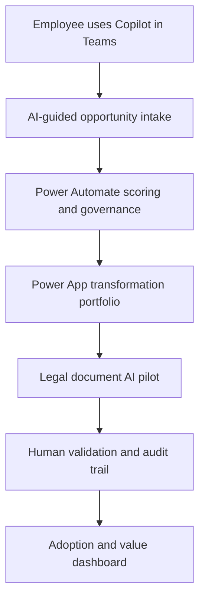

# Enterprise Legal AI Transformation Hub

> Copilot-powered use-case discovery, prioritization, governance, legal-document automation, adoption, and benefits tracking.

## Executive summary

This repository is a GitHub-ready reference implementation for a legal-services AI transformation program built with Microsoft Copilot Studio, Power Automate, Power Apps, Dataverse, Microsoft Teams, AI Builder, and Power BI.

The demonstration follows one coherent story:

1. An employee proposes a contract-review automation through Copilot in Teams.
2. Copilot gathers the business context and creates a structured opportunity.
3. Power Automate calculates a transparent priority score and routes governance approvals.
4. The approved pilot extracts key information from a synthetic agreement.
5. A legal reviewer validates low-confidence or high-risk results.
6. Adoption, feedback, risks, delivery status, and benefits appear in a leadership dashboard.

The project deliberately uses synthetic data. It is a portfolio demonstration, not legal advice and not a production legal-review system.

## Why this project is strong

It demonstrates more than a chatbot. It combines:

- AI and digital enablement
- Process analysis and business-process redesign
- Microsoft 365 integration
- Low-code solution delivery
- Stakeholder and relationship management
- Governance and human oversight
- Portfolio prioritization and business cases
- Change management, training, and feedback loops
- Leadership reporting and measurable value
- Project management, QA, exception handling, and auditability

See [JD capability mapping](docs/jd-capability-mapping.md) for the full alignment.

## Architecture



## Repository contents

| Folder | Purpose |
| --- | --- |
| `copilot-studio/` | Agent instructions, topics, prompts, and expected behaviors |
| `power-automate/` | Build-ready workflow blueprints and Power Automate expressions |
| `dataverse/` | Table, column, relationship, and choice definitions |
| `power-apps/` | Screen specifications and Power Fx formulas |
| `analytics/` | KPI catalog and sample dashboard dataset |
| `src/` | Executable scoring and AI-evaluation utilities |
| `samples/` | Synthetic contract, opportunity, feedback, and extraction data |
| `tests/` | Automated scoring tests and UAT scenarios |
| `docs/` | Governance, RACI, process maps, deployment, demo, and roadmap |
| `demo/` | Browser-based team showcase requiring no Microsoft tenant |

## Quick start: local showcase

Requirements: Python 3.10+.

```bash
python -m unittest discover -s tests -v
python src/scoring.py samples/opportunity-intake.json
python src/evaluate_extraction.py \
  samples/expected-extraction.json \
  samples/sample-ai-output.json
python -m http.server 8000 --directory demo
```

Then open `http://localhost:8000` to run the click-through team demonstration.

## Power Platform implementation

1. Create a development environment with Dataverse.
2. Create a publisher and unmanaged solution named `LegalAITransformationHub`.
3. Build the tables in [dataverse/schema.csv](dataverse/schema.csv).
4. Create environment variables and connection references listed in [deployment guide](docs/deployment-guide.md).
5. Build the four flows from the specifications in `power-automate/flows/`.
6. Configure the Copilot Studio agent using `copilot-studio/agent-instructions.md` and the topic definitions.
7. Create the model-driven portfolio app using `power-apps/app-specification.md`.
8. Load synthetic samples, execute UAT, and capture evidence.
9. Export the solution as both managed and unmanaged packages from the tenant.

Tenant-generated solution exports are intentionally excluded from this starter because connection references, IDs, ownership, and licensed AI actions must be created in the target Microsoft environment.

## Security and governance principles

- Least-privilege role-based access
- No client data in the demonstration
- Human review for low-confidence or high-risk output
- AI output labeled as draft and not legal advice
- Complete approval, correction, and decision audit trail
- Configurable retention and sensitivity classification
- No secrets, tokens, connection strings, or tenant identifiers in GitHub
- Prompt-injection and unsupported-file test cases

## Demo success criteria

- Copilot completes a structured intake without missing required fields.
- Priority score is reproducible and explainable.
- High-risk opportunities require governance review.
- Low-confidence document fields require human validation.
- Every decision and correction is auditable.
- Dashboard totals reconcile with source records.
- Feedback creates an actionable improvement item.

## Suggested repository topics

`microsoft-copilot` `copilot-studio` `power-automate` `power-platform` `power-apps` `dataverse` `ai-governance` `legal-tech` `digital-transformation` `human-in-the-loop`

## License

MIT. See [LICENSE](LICENSE).

