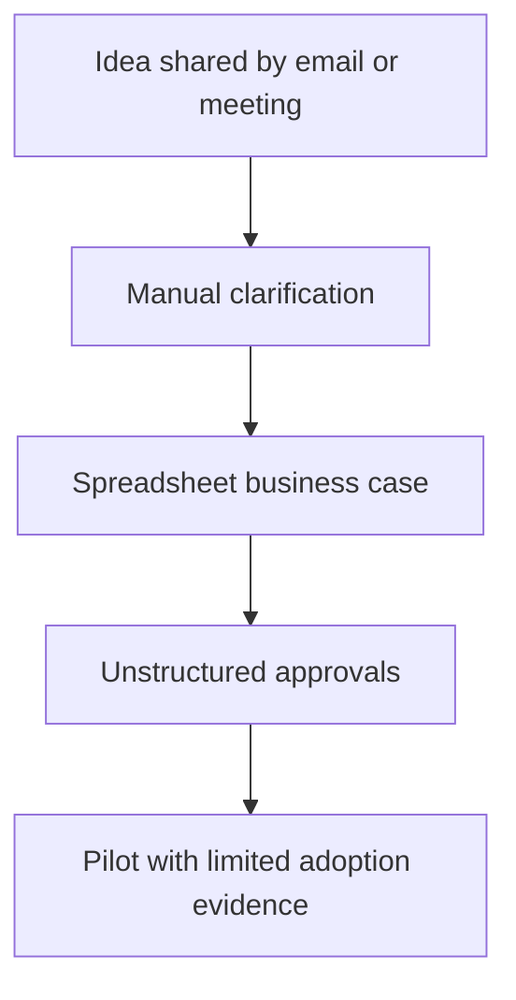
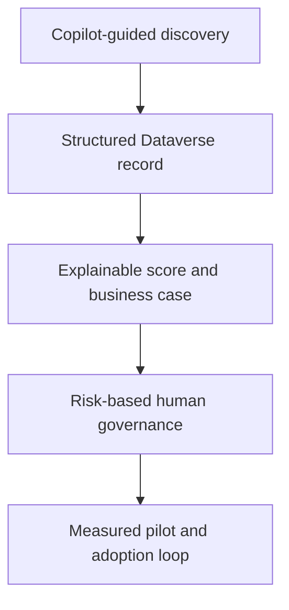

# Process redesign

## Current state

Common issues: incomplete requirements, duplicate proposals, inconsistent evaluation, unclear ownership, approval delays, limited auditability, and benefits reported without a stable baseline.

## Future state

## Control-point improvements

| Pain point | Redesign | Measure |
| --- | --- | --- |
| Incomplete intake | Copilot asks for missing required information | First-pass completeness |
| Inconsistent prioritization | Versioned weighted score plus human decision | Decision consistency and lead time |
| Approval ambiguity | Risk-based RACI and recorded conditions | Approval aging and overdue reviews |
| AI error risk | Confidence threshold, citations, human correction | Accuracy and override rate |
| Weak adoption | Targeted training and scheduled feedback | Training, activation, satisfaction |
| Unverified value | Baseline and validated benefits review | Expected vs validated hours |

