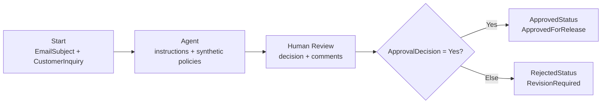

# Project: Governed AI Policy Response Assistant

This folder contains the Microsoft Copilot Studio Workflow that I designed, configured, tested, and documented as an independent portfolio project.

## My implementation

I built the working prototype in **Copilot Studio Workflows**. I did not create or execute a separate Power Automate cloud flow.

## How the prototype is triggered

The implemented workflow uses a **Manual** Start trigger. A tester opens the workflow, enters `EmailSubject` and `CustomerInquiry`, and runs it. Publishing this workflow does not create a user-facing chat interface.

I prepared a conversational-agent configuration so a user message could become the trigger. Copilot Studio refused to create the agent because the academic tenant reported **User license not found** and insufficient permission to create agents. The exact target design, administrator prerequisites, deployment steps, and acceptance criteria are documented in [Conversational Agent Deployment](conversational-agent-deployment.md).

| Capability | Status | Evidence |
| --- | --- | --- |
| Workflow configured and published | Complete | [Workflow screenshot](evidence/screenshots/01-published-copilot-workflow.png) |
| Governed Agent instructions | Complete | [Agent instructions](copilot-agent-instructions.md) |
| Address-update Agent test | Passed | [Agent test](evidence/screenshots/02-agent-node-test-passed.png) |
| Outlook Human Review request | Delivered | [Redacted evidence](evidence/screenshots/03-human-review-request-delivered-redacted.png) |
| Approval callback | Blocked | Tenant returned HTTP 400 |
| Teams notification | Blocked | Tenant returned HumanInTheLoopNotificationFailed |
| Complete workflow run | Blocked | No Copilot Credits were available |
| Approval and revision execution | Not completed | Callback and credits required |
| External customer email | Not implemented | Deliberately excluded |
| End-to-end UAT | Not complete | [UAT scorecard](evidence/uat-scorecard.md) |
| Conversational user-query trigger | Blocked | Agent configuration prepared; tenant reported missing license/role |

## Teams chatbot extension

I designed a Phase 2 extension that uses the current workflow as the governed processing foundation:

1. A Copilot Studio agent receives the user inquiry in Teams.
2. Generate Policy Draft reuses the current Agent instructions and returns a structured, unapproved draft immediately.
3. Submit Review Request creates a RequestId without making the chat wait for a reviewer.
4. Process Human Review reuses the current Human Review, If/Else and outcome logic asynchronously.
5. Get Review Status lets the user check the decision from Teams.
6. No external customer response is sent automatically.

The complete design is documented in [End-to-End Teams Chatbot Blueprint](teams-chatbot-end-to-end-blueprint.md). It is a target implementation until tenant access permits agent creation, Teams publication and complete UAT.

## Controls I configured

- customer inquiry treated as untrusted input
- only the embedded synthetic policies may support a draft
- missing or conflicting support requires escalation
- no legal advice, liability admission, compensation promise, or restricted disclosure
- privacy, litigation, fraud, security, discrimination, and regulatory matters require review
- no automatic customer email
- explicit Human Review decision and comments
- separate approved and revision outcomes

## Knowledge approach

The tenant exposed SharePoint and organization-owned public websites as managed knowledge options. I did not have an approved SharePoint repository, and direct local-file knowledge upload was unavailable. I embedded three short synthetic policies in the Agent instructions for the prototype.

This is an inline governed-context implementation. I do not present it as RAG, a vector database, or SharePoint grounding.

## Repository guide

| File | Purpose |
| --- | --- |
| [IMPLEMENTATION-STATUS.md](IMPLEMENTATION-STATUS.md) | Authoritative implemented, passed, blocked, and unclaimed status |
| [copilot-agent-instructions.md](copilot-agent-instructions.md) | Instructions and synthetic policy context used in the Agent |
| [conversational-agent-deployment.md](conversational-agent-deployment.md) | User-query trigger design, tenant blocker, deployment steps, and acceptance criteria |
| [teams-chatbot-end-to-end-blueprint.md](teams-chatbot-end-to-end-blueprint.md) | Teams architecture, current-workflow reuse, data contracts, failure behavior, and UAT |
| [teams-chatbot-rtm-and-uat.md](teams-chatbot-rtm-and-uat.md) | Teams requirements traceability, acceptance tests, and required evidence |
| [business-requirements.md](business-requirements.md) | Problem, scope, requirements, stakeholders, and acceptance criteria |
| [governance-and-controls.md](governance-and-controls.md) | Risks, ownership, responsible-AI controls, and go-live gates |
| [exception-handling.md](exception-handling.md) | Fail-closed production resilience design |
| [evidence/README.md](evidence/README.md) | Screenshot register and validation limitations |
| [evidence/uat-scorecard.md](evidence/uat-scorecard.md) | Executed, blocked, and pending tests |
| [samples/](samples/) | Synthetic policies and test inquiries |
| [demo-script.md](demo-script.md) | Evidence-safe technical demonstration |
| [uat-and-interview-guide.md](uat-and-interview-guide.md) | Interview explanation and questions |
| [portfolio-case-study.md](portfolio-case-study.md) | Business and AI-transformation narrative |
| [Governed_AI_Policy_Response_Assistant_Case_Study.pdf](Governed_AI_Policy_Response_Assistant_Case_Study.pdf) | One-page technical-team summary |

## When something fails

The published prototype does not yet contain the full production failure path. My [exception-handling design](exception-handling.md) specifies fail-closed behavior, input validation, correlation IDs, bounded retries, timeouts, escalation, durable error logging, duplicate prevention, alerts, and explicit terminal states.

Until those controls are implemented and tested, a failure must keep the item unsent and route it to manual handling.

## Evidence boundary

I claim only what the screenshots and platform results support:

- a real workflow was configured and published;
- the Agent executed successfully for one synthetic inquiry;
- an Outlook Human Review request was delivered;
- tenant restrictions prevented callback and complete execution;
- conversational agent creation was attempted but blocked by a missing user license or role.

I do not claim Power Automate implementation, production deployment, SharePoint grounding, successful end-to-end approval, customer email dispatch, or measured business benefits.
