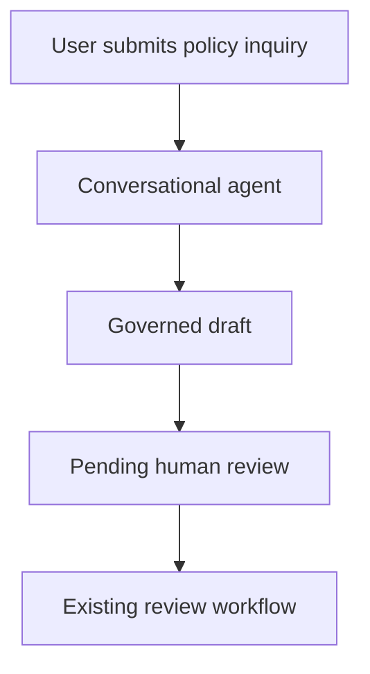

# Conversational Agent Deployment

## Purpose

This document defines the user-query trigger that would convert the published workflow prototype into a user-facing Copilot experience. The authoritative end-to-end component design is maintained in [End-to-End Teams Chatbot Blueprint](teams-chatbot-end-to-end-blueprint.md).

## Current status

**Configuration prepared:** 26 August 2026  
**Environment tested:** DePaul University (default)  
**Creation result:** Blocked by tenant permissions  
**Platform message:** `You don't have permission to create agents. Ask your admin to grant you the right role, then try again. User license not found.`

The agent name, governed instructions, synthetic policies, and web-search restriction were configured in the new-agent editor. Copilot Studio did not create or save an agent record because the signed-in account lacks the required agent license or role. This repository therefore does not claim that a conversational agent is deployed.

## Target trigger

The intended trigger is a user message in the Copilot Studio test chat, a demo website, Microsoft Teams, or Microsoft 365 Copilot.

The current workflow remains manually triggered. Publishing a manual workflow does not create a chat interface.

The Teams design does not place Human Review in the synchronous chat-response path. The agent first returns an unapproved draft, then creates a durable RequestId for asynchronous review. The existing Human Review, If/Else and outcome logic is reused by the review processor.

## Prepared agent configuration

| Field | Value |
| --- | --- |
| Display name | Policy Response Assistant |
| Purpose | Produce a policy-grounded draft for internal human review |
| Input | A policy question, or an email subject and customer inquiry |
| Output | Decision, draft response, policy basis, review note, and approval status |
| Knowledge approach | Inline synthetic policies |
| Web search | Disabled |
| External send | Disabled |
| Approval status | Always Pending human review |

The complete governed instruction set is maintained in [copilot-agent-instructions.md](copilot-agent-instructions.md).

## Required administrator action

An administrator must:

1. Assign a Copilot Studio license or approved capacity to the user.
2. Grant an environment security role that permits agent creation.
3. Confirm that agent publication and the intended Teams or Microsoft 365 channel are allowed.
4. Confirm whether Human Review and Outlook or Teams notification connectors are approved.

## Deployment steps after access is granted

1. Open **Copilot Studio > Agents > New agent**.
2. Set the name to **Policy Response Assistant**.
3. Paste the governed instructions and synthetic policies.
4. Remove **Search all websites**.
5. Save the agent.
6. Test the three cases in [samples/test-cases.md](samples/test-cases.md).
7. Verify that every answer includes `Pending human review`.
8. Publish only after the tests pass.
9. Add an approved channel, such as Microsoft Teams.
10. Capture redacted evidence and update [IMPLEMENTATION-STATUS.md](IMPLEMENTATION-STATUS.md).

## Workflow integration after licensing

To attach an agent flow as a conversational tool, the flow must use:

- **When an agent calls the flow** as its trigger;
- explicit request inputs;
- **Respond to the agent** as its final action.

The published manual workflow should be preserved as evidence. Create a duplicate for agent-triggered integration. The duplicate should return a safe acknowledgement or final review status and must fail closed if Human Review, notification, or capacity is unavailable.

## Acceptance criteria

The conversational enhancement is complete only when:

- a user message triggers the agent without opening the workflow designer;
- all three synthetic test cases return the required structured sections;
- the output is labelled pending human review;
- web search is disabled;
- the agent is saved and published;
- the selected channel is tested;
- evidence is redacted and recorded;
- unsupported, unsafe, and injection-style requests fail safely.
