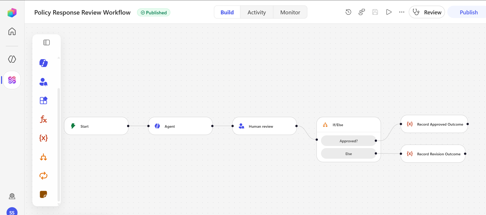
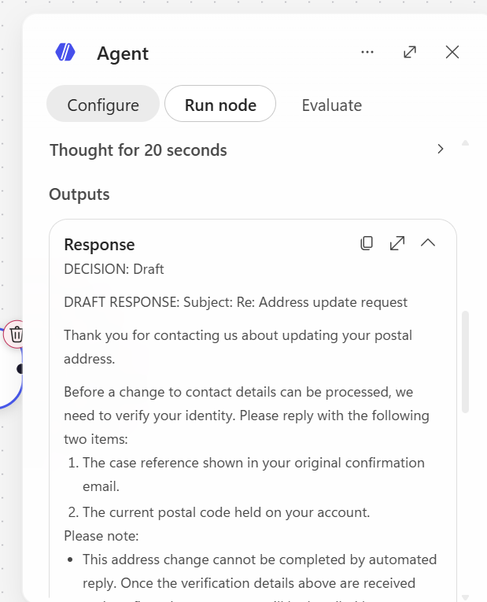

# Evidence Register

This register distinguishes implemented evidence, partial validation, target design, and work that remains blocked. Screenshots use synthetic data and redact personal identifiers.

## Evidence status

| ID | Evidence | Status | What it proves |
| --- | --- | --- | --- |
| E01 | Requirements and acceptance criteria | Complete | Business scope and controls are documented |
| E02 | Implemented Agent instructions | Complete | Governed prompt, safety rules, and inline policies are versioned |
| E03 | Synthetic policy and test pack | Complete | Demonstration content contains no production data |
| E04 | Published workflow screenshot | Complete | Copilot Studio workflow is configured and published |
| E05 | Agent node test | Passed | Agent produced a safe identity-policy draft |
| E06 | Outlook Human Review request | Delivered | Review request and fields rendered successfully |
| E07 | Human Review response callback | Blocked | HTTP 400 prevented confirmation |
| E08 | Teams Human Review notification | Blocked | Tenant returned HumanInTheLoopNotificationFailed |
| E09 | Complete workflow execution | Blocked | Environment had no available Copilot Credits |
| E10 | Approved/revision branch execution | Not run | Depends on a successful Human Review callback |
| E11 | Full UAT scorecard | Partial | One Agent scenario passed; remaining scenarios are pending or blocked |
| E12 | Production approvals and deployment | Not started | Outside portfolio-prototype scope |

## E04 - Published Copilot Studio workflow

The published canvas shows the manual trigger, governed Agent, Human Review, approval condition, and separate approved/revision outcome records.

## E05 - Successful Agent node test

The Agent returned a draft for an address-update inquiry. It requested only the permitted case reference and current postal code, warned against emailing restricted credentials, avoided claiming the change was complete, cited the synthetic identity policy, and required human review.

## E06 - Outlook Human Review request delivered

The redacted screenshot proves that Microsoft delivered and rendered the configured review request, AI draft, policy basis, Yes/No decision, and reviewer-comment input. It does **not** prove completed approval: the callback returned HTTP 400 and is recorded as blocked.

## Validation limitations

- Node-level Agent testing succeeded.
- Outlook Human Review delivery succeeded, but the submit callback failed.
- Teams notification delivery failed under the tenant's managed notification service.
- Full workflow execution was blocked by unavailable Copilot Credits.
- No outbound customer email was configured or sent.
- No error screenshot is presented as successful evidence.

## Screenshot standards

- PNG format, cropped to the relevant interface
- personal names, email addresses, tenant URLs, and environment identifiers redacted
- synthetic inquiries only
- captions state exactly what each image proves
- partial or blocked results never labeled complete
